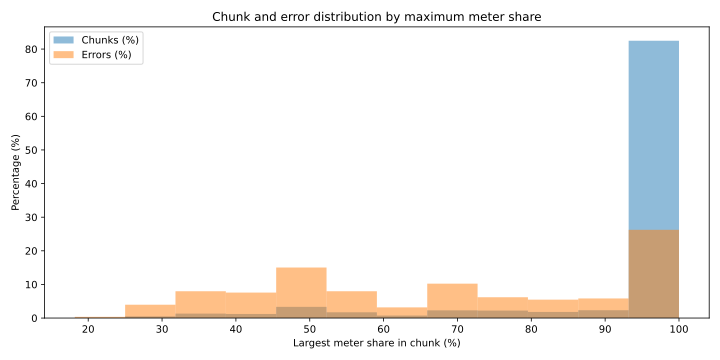

#+PROPERTY: header-args :dir ..

#+begin_src python :results file link
  import sqlite3
  from collections import defaultdict, Counter

  from velimir.settings import PREDICTION_DB_PATH

  chunk_query = """
  WITH chunk_totals AS
  (SELECT poem_path, chunk_idx, COUNT(*) AS chunk_total
  FROM predictions GROUP BY poem_path, chunk_idx),
  chunk_errors AS
  (SELECT poem_path, chunk_idx, COUNT(*) AS chunk_error_count
  FROM predictions 
  WHERE meter_class_pred <> meter_class_target
  GROUP BY poem_path, chunk_idx)
  SELECT
      p.poem_path,
      p.chunk_idx,
      p.meter_class_target,
      COUNT(*) AS meter_count,
      c.chunk_total,
      e.chunk_error_count
  FROM predictions p
  JOIN chunk_totals c 
      ON p.poem_path = c.poem_path 
      AND p.chunk_idx = c.chunk_idx
  LEFT JOIN chunk_errors e
      ON p.poem_path = e.poem_path 
      AND p.chunk_idx = e.chunk_idx
  GROUP BY p.poem_path, p.chunk_idx, p.meter_class_target
  """

  conn = sqlite3.connect(PREDICTION_DB_PATH)

  try:
      cursor = conn.cursor()
      cursor.execute(chunk_query)
      rows = cursor.fetchall()
  finally:
      conn.close()

  chunk_agg = defaultdict(list)
  error_values = {}

  for row in rows:
      chunk_id = row[0:2]
      meter_count, chunk_total, error_total = row[3:]

      chunk_agg[chunk_id].append(meter_count / chunk_total * 100)
      error_values[chunk_id] = error_total or 0

  import matplotlib.pyplot as plt
  import numpy as np

  PLOT_PATH = "notebooks/error_per_meter_diversity.svg"

  max_values = []
  error_counts = []

  for chunk_id, chunk in chunk_agg.items():
      max_values.append(max(chunk))
      error_counts.append(error_values[chunk_id])
  # Get common bins
  counts_per_bin, bin_edges = np.histogram(
      max_values,
      bins=12
  )

  errors_per_bin, _ = np.histogram(
      max_values,
      bins=bin_edges,
      weights=error_counts
  )

  # Convert to percentages
  chunk_percentage = counts_per_bin / counts_per_bin.sum() * 100
  error_percentage = errors_per_bin / errors_per_bin.sum() * 100

  x = bin_edges[:-1]
  width = np.diff(bin_edges)

  plt.figure(figsize=(10, 5))

  plt.bar(
      x,
      chunk_percentage,
      width=width,
      align="edge",
      alpha=0.5,
      label="Chunks (%)"
  )

  plt.bar(
      x,
      error_percentage,
      width=width,
      align="edge",
      alpha=0.5,
      label="Errors (%)"
  )

  plt.xlabel("Largest meter share in chunk (%)")
  plt.ylabel("Percentage (%)")
  plt.title("Chunk and error distribution by maximum meter share")
  plt.legend()

  plt.tight_layout()
  plt.savefig(PLOT_PATH)
  return PLOT_PATH
#+end_src

#+RESULTS:

