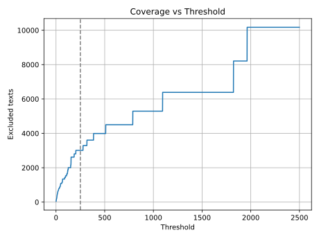

#+PROPERTY: header-args :dir ..
#+PROPERTY: header-args:python :session meter-classes

Analyze meter classes present in the dataset. Selected meter classes are used in model training.

#+begin_src python :results output
  from collections import Counter
  from itertools import islice
  from dataclasses import dataclass

  from velimir.domain_models import Poem, MeterType
  from velimir.io import load_poems_from_msgpack

  poems = load_poems_from_msgpack()

  meter_class_examples = {}
  meter_class_counter = Counter()

  for poem in poems:
      for i, line in enumerate(poem.lines):
          mclass = line.to_meterclass()
          meter_class_counter[mclass] += 1

          if mclass not in meter_class_examples: 
              meter_class_examples[mclass] = (poem.path, i)

  print(f"Total of {meter_class_counter.total()} lines analyzed")
  print(f"{len(meter_class_counter)} meter classes identified")
#+end_src

#+RESULTS:
: Total of 2869064 lines analyzed
: 195 meter classes identified

#+begin_src python :results graphics file value :file notebooks/coverage_vs_threshold.svg
  import numpy as np
  import matplotlib.pyplot as plt

  # TODO
#+end_src

#+RESULTS:

#+begin_src python :results output
  MIN_COUNT = 250

  discarded = 0
  discarded_items = 0

  vocab = []

  for mclass, i in meter_class_counter.most_common():
      if i < MIN_COUNT:
          discarded += 1
          discarded_items += i
          continue

      vocab.append(mclass)

  print(f"Discarded {discarded} meter classes as too rare (represent {discarded_items} lines)")
  print(f"Discarded data represents {discarded_items / meter_class_counter.total()} of lines")
  print(f"Total of {len(vocab)} meter classes accepted")
#+end_src

#+RESULTS:
: Discarded 173 meter classes as too rare (represent 3132 lines)
: Discarded data represents 0.0010916452194862157 of lines
: Total of 22 meter classes accepted

Dump class vocab to a file
#+begin_src python :results output
  import json
  from dataclasses import asdict

  from velimir.settings import METER_VOCAB_PATH

  with open(METER_VOCAB_PATH, "w") as f:
      for mclass in vocab:
          entry = asdict(mclass)
          entry["count"] = meter_class_counter[mclass]
          entry["caesura"] = list(map(str, entry["caesura"]))
          json.dump(entry, f)
          f.write("\n")

  print(f"dump meter classes to {METER_VOCAB_PATH}")
#+end_src

#+RESULTS:
: dump meter classes to data/meter_vocab.jsonl

Collect examples for selected classes (RNC files are required)
#+begin_src python :results table
  from bs4 import BeautifulSoup

  from velimir.parsers import extract_lines
  from velimir.io import read_poem_xml
  from velimir.validation import meters_to_str

  examples = []

  for mclass in vocab:
      poem_path, line_id = meter_class_examples[mclass]

      poem_xml = read_poem_xml(poem_path)
      soup = BeautifulSoup(poem_xml, "xml")
      lines = list(extract_lines(soup))

      line = lines[line_id]
      caesura_repr = "-".join(map(str, mclass.caesura))

      examples.append((line.text, meters_to_str(mclass), caesura_repr or "-", poem_path, meter_class_counter[mclass]))

  examples
#+end_src

#+RESULTS:
| Ещѐ вкруг со̀лнцев нѐ враща̀лись                            | Я     | -   | xix/1790-1810_poets/poets-001 | 1472270 |
| Стра̀шна о̀трасль днѐй небѐсных,                            | Х     | -   | xix/1790-1810_poets/poets-008 |  514430 |
| В осьмисо̀т во двадца̀том году,                             | Ан    | -   | xix/1790-1810_poets/poets-111 |  210449 |
| Прѐобразѝтель словѐсности на̀шей пѝшет, об нѐй рассужда̀я,  | Дк    | -   | xix/1790-1810_poets/poets-109 |  205477 |
| Игра̀йте, пото̀ки, на мя̀гких луга̀х,                         | Аф    | -   | xix/1790-1810_poets/poets-026 |  201526 |
| Лѐто паля̀ще летѝт;                                        | Д     | -   | xix/1790-1810_poets/poets-014 |  135253 |
| На широ̀ком Каменно̀м мосту,                                | Тк    | -   | xix/1790-1810_poets/poets-111 |   39623 |
| Му̀з благода̀тных сла̀вный любѝмец, владѐющий лѝрой,         | Гек   | -   | xix/1790-1810_poets/poets-109 |   30943 |
| Восста̀нут ли бессмы̀сленные на му̀дрых и сла̀бые на крѐпких! | Ак    | -   | xix/1790-1810_poets/poets-290 |   15998 |
| Богиня моя! ты в рощах свящѐнных,                         | С     | -   | xix/volsnx/vols-033           |   10699 |
| Пусть злы̀е лю̀ди венѐц сплета̀ют,                           | Я~Я   | 1/2 | xix/1790-1810_poets/poets-439 |    7627 |
| О̀ пита̀тельница̀ река̀ Нева̀                                  | Л     | -   | xix/1790-1810_poets/poets-162 |    5749 |
| Мѝрный зла̀к полѐй ѝссушѝла о̀сень;                         | Х~Х   | 1/2 | xix/1790-1810_poets/poets-170 |    4966 |
| Слы̀шать в гумнѐ на току̀ бо̀й в лад цепо̀в молотя̀щих:        | Д~Д   | 1/2 | xix/1790-1810_poets/poets-109 |    3738 |
| Лето кра̀сное! проходѝ скорей,                             | Ан~Ан | 1/2 | xix/1790-1810_poets/poets-116 |    1957 |
| Со̀вет в сѐрдце во̀пиѐт, пла̀чу ѝ рыда̀ю!                     | Х~Х   | 4/7 | xix/1790-1810_poets/psec-153  |    1833 |
| Ѐму о̀пера̀тор                                              | Х*    | -   | xix/1830/1830-255             |    1095 |
| За зна̀мя отчѝзны гру̀дью стоя̀ть!                           | Дк    | 1/2 | xix/1820/1820-271             |     790 |
| Сво̀да пещѐрного,                                          | Я*    | -   | xix/konevskoj/konev-010       |     525 |
| Ты̀, что сто̀лько кра̀т тѐшила в жѝзни меня̀.                 | Пен   | -   | xix/1790-1810_poets/poets-319 |     387 |
| Однѝ ли несча̀стные знако̀мы с тобо̀ю,                       | Аф~Аф | 1/2 | xix/1790-1810_poets/psec-012  |     317 |
| Там далѐко-далѐко, где навѝс очаро̀ванный лѐс,             | Ан~Ан | 2/5 | xix/lochvicka/mloch-186       |     280 |
