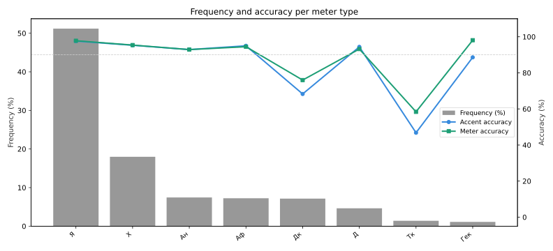

#+PROPERTY: header-args :dir ..
#+PROPERTY: header-args:sqlite :db data/predictions.db :colnames yes

Собираем данные.
#+begin_src sh
  python evaluate_models.py
#+end_src

#+RESULTS:

Лог сборки данных.
#+begin_src sh
  cat main.log
#+end_src

#+RESULTS:
| 2026-04-19 16:09:25 | 095 [INFO] Using device: cpu                                               |
| 2026-04-19 16:09:25 | 115 [INFO] Loading raw samples                                             |
| 2026-04-19 16:09:55 | 820 [INFO] 3010 lines are excluded from dataset as having rare meter types |
| 2026-04-19 16:09:59 | 691 [INFO] Loading poetry dataset                                          |
| 2026-04-19 16:10:00 | 588 [INFO] Dataset loading finished. 57264 samples created                 |
| 2026-04-19 16:10:50 | 945 [INFO] accent_accuracy=0.983621                                        |
| 2026-04-19 16:10:50 | 945 [INFO] meter_accuracy=0.940818                                         |

Процент попаданий для предсказаний метра и ритма

NB: точность для ударений в логе выше, т.к. при логировании
используется расчёт по токенам, а не сравнение формул целиком.
Например, при расчёте по токенам учитывается схожесть между
ритмическими формулами "0101" и "1001". SQL-запрос учитывает только
полные совпадения.
#+begin_src sqlite
  SELECT
    ROUND(AVG(accent_target == accent_pred), 3) as accent_ok,
    ROUND(AVG(meter_target == meter_pred), 3) as meter_ok
  FROM predictions
#+end_src

#+RESULTS:
| accent_ok | meter_ok |
|-----------+----------|
|     0.932 |    0.941 |

Процент попаданий метра и ритма, распределённый по наиболее частым метрам
#+name: accuracy_per_meter
#+begin_src sqlite
  SELECT * FROM (
  SELECT meter_target as meter,
      ROUND(AVG(accent_target == accent_pred), 3) as accent_ok,
      ROUND(AVG(meter_target == meter_pred), 3) as meter_ok,
      ROUND(COUNT(*) * 1.0 / SUM(COUNT(*)) OVER (), 4) AS freq
  FROM predictions
  GROUP BY meter_target
  )
  WHERE freq >= 0.01
  ORDER BY freq DESC
#+end_src

#+RESULTS: accuracy_per_meter
| meter | accent_ok | meter_ok |   freq |
|-------+-----------+----------+--------|
| Я     |     0.977 |    0.976 | 0.5125 |
| Х     |     0.952 |    0.952 | 0.1823 |
| Ан    |     0.935 |    0.937 |  0.073 |
| Дк    |     0.674 |     0.77 |  0.072 |
| Аф    |     0.942 |    0.937 | 0.0694 |
| Д     |     0.935 |    0.926 | 0.0477 |
| Тк    |     0.515 |    0.676 | 0.0133 |
| Гек   |     0.911 |    0.978 | 0.0112 |

График, отображающий точность определения метра и ритма по типу метра.
#+begin_src python :var data=accuracy_per_meter :results file link
  import matplotlib.pyplot as plt
  import matplotlib.ticker as mtick
  import numpy as np

  meters, accent, meter_acc, freq = zip(*data)

  BLUE, GREEN, GRAY = "#378ADD", "#1D9E75", "#888780"
  PLOT_PATH = "notebooks/dual_axis.svg"

  fig, ax1 = plt.subplots(figsize=(11, 5))

  x = np.arange(len(meters))
  ax1.bar(x, [f * 100 for f in freq], color="#333", alpha=0.5, label="Frequency (%)")
  ax1.set_ylabel("Frequency (%)", color="#333")
  ax1.tick_params(axis="y", color="#333")
  ax1.set_xticks(x)
  ax1.set_xticklabels(meters, rotation=40, ha="right", fontsize=9)

  ax2 = ax1.twinx()
  ax2.plot(x, [a * 100 for a in accent],   "o-", color=BLUE,  lw=2, ms=5, label="Accent accuracy")
  ax2.plot(x, [m * 100 for m in meter_acc], "s-", color=GREEN, lw=2, ms=5, label="Meter accuracy")
  ax2.set_ylabel("Accuracy (%)", color="#333")
  ax2.set_ylim(-5, 110)
  ax2.axhline(90, color="#ccc", lw=0.8, linestyle="--")

  lines1, labs1 = ax1.get_legend_handles_labels()
  lines2, labs2 = ax2.get_legend_handles_labels()
  ax1.legend(lines1 + lines2, labs1 + labs2, loc="center right", framealpha=0.6, fontsize=9)
  ax1.set_title("Frequency and accuracy per meter type", fontsize=12)
  plt.tight_layout()
  plt.savefig(PLOT_PATH, dpi=150)

  return PLOT_PATH
#+end_src

#+RESULTS:

Для каждого метра собираем соотношение попаданий при правильно
предсказанном ритме, ошибочно предсказанном ритме и общее соотношение
правильных предсказаний.
#+begin_src sqlite
  SELECT
      meter_target as meter,
      ROUND(AVG(accent_pred == accent_target), 3) AS accent_ok_total,
      ROUND(AVG(meter_target == meter_pred), 3) AS meter_ok_total,
      ROUND(AVG(CASE WHEN meter_target == meter_pred THEN accent_target == accent_pred END), 3) AS accent_ok_given_meter_ok,
      ROUND(AVG(CASE WHEN meter_target <> meter_pred THEN accent_target == accent_pred END), 3) AS accent_ok_given_meter_bad,
      COUNT(*) as total
  FROM predictions
  GROUP BY meter_target
  ORDER BY total DESC;
#+end_src

#+RESULTS:
| meter | accent_ok_total | meter_ok_total | accent_ok_given_meter_ok | accent_ok_given_meter_bad | total |
|-------+-----------------+----------------+--------------------------+---------------------------+-------|
| Я     |           0.977 |          0.976 |                    0.996 |                     0.195 | 29346 |
| Х     |           0.952 |          0.952 |                    0.992 |                     0.168 | 10439 |
| Ан    |           0.935 |          0.937 |                    0.998 |                     0.008 |  4180 |
| Дк    |           0.674 |           0.77 |                    0.834 |                     0.139 |  4124 |
| Аф    |           0.942 |          0.937 |                    0.999 |                     0.107 |  3976 |
| Д     |           0.935 |          0.926 |                    0.999 |                     0.143 |  2732 |
| Тк    |           0.515 |          0.676 |                    0.727 |                     0.073 |   759 |
| Гек   |           0.911 |          0.978 |                    0.927 |                     0.214 |   640 |
| Ак    |           0.566 |          0.754 |                    0.696 |                     0.164 |   297 |
| С     |           0.811 |          0.816 |                    0.993 |                       0.0 |   185 |
| Я~Я   |            0.94 |           0.94 |                    0.993 |                     0.111 |   151 |
| Х~Х   |           0.779 |          0.793 |                    0.964 |                     0.069 |   140 |
| Л     |           0.659 |          0.455 |                    0.732 |                     0.597 |   123 |
| Д~Д   |           0.882 |          0.842 |                    0.984 |                     0.333 |    76 |
| Ан~Ан |           0.955 |          0.932 |                      1.0 |                     0.333 |    44 |
| Х*    |           0.722 |          0.556 |                      1.0 |                     0.375 |    18 |
| Я*    |             0.5 |          0.313 |                      1.0 |                     0.273 |    16 |
| Пен   |             0.4 |            0.3 |                      1.0 |                     0.143 |    10 |
| Аф~Аф |             1.0 |           0.75 |                      1.0 |                       1.0 |     8 |

Частота присутствия цезуры
#+begin_src sqlite
  SELECT
      ROUND(
          COUNT(*) * 1.0 /
          (SELECT COUNT(*) FROM predictions),
          4
      ) AS caesura_freq
  FROM predictions
  WHERE caesura_target <> '';
#+end_src

#+RESULTS:
| caesura_freq |
|--------------|
|       0.0076 |

Ложнопозитивные определения цезуры
#+begin_src sqlite
  SELECT
      ROUND(
          SUM(caesura_target = '' AND caesura_pred <> '') * 1.0 /
          SUM(caesura_target = ''),
          4
      ) AS false_positive_rate
  FROM predictions;
#+end_src

#+RESULTS:
| false_positive_rate |
|---------------------|
|              0.0048 |

Точность в определении цезуры, метра и ударения для тех строк, где присутствует цезура
#+begin_src sqlite
  SELECT ROUND(AVG(caesura_target == caesura_pred), 3) as caesura_ok,
  ROUND(AVG(meter_target == meter_pred), 3) as meter_ok,
  ROUND(AVG(accent_target == accent_pred), 3) as accent_ok
  FROM predictions
  WHERE caesura_target <> ''
#+end_src

#+RESULTS:
| caesura_ok | meter_ok | accent_ok |
|------------+----------+-----------|
|      0.859 |    0.857 |     0.875 |

Точность в определении цезурных форм
#+begin_src sqlite
  SELECT * FROM
      (SELECT
          caesura_target AS caesura,
          caesura_pred,
          meter_target,
          meter_pred,
          accent_pred == accent_target AS accent_ok,
          COUNT(*) AS cnt
      FROM predictions
      WHERE caesura_target <> ''
      GROUP BY caesura_target, caesura_pred, meter_target, meter_pred
      ORDER BY cnt DESC)
  WHERE cnt > 5
#+end_src

#+RESULTS:
| caesura | caesura_pred | meter_target | meter_pred | accent_ok | cnt |
|---------+--------------+--------------+------------+-----------+-----|
| 1/2     | 1/2          | Я~Я          | Я~Я        |         1 | 142 |
| 1/2     | 1/2          | Х~Х          | Х~Х        |         1 |  76 |
| 1/2     | 1/2          | Д~Д          | Д~Д        |         1 |  64 |
| 1/2     | 1/2          | Ан~Ан        | Ан~Ан      |         1 |  41 |
| 4/7     | 4/7          | Х~Х          | Х~Х        |         1 |  33 |
| 1/2     |              | Х~Х          | Дк         |         0 |  12 |
| 1/2     |              | Д~Д          | Дк         |         0 |   8 |
| 1/2     | 1/2          | Аф~Аф        | Аф~Аф      |         1 |   6 |
| 1/2     | 1/2          | Дк           | Дк         |         1 |   6 |

View для сбора ошибок при определении метра
#+begin_src sqlite
  CREATE VIEW meter_errors AS
  SELECT 
      meter_target,
      meter_pred,
      accent_pred == accent_target AS accent_ok,
      COUNT(*) as cnt
  FROM predictions
  WHERE meter_target <> meter_pred
  GROUP BY meter_target, meter_pred, accent_ok;
#+end_src

#+RESULTS:

Ошибки при определении дольника
#+begin_src sqlite
  SELECT *
  FROM meter_errors
  WHERE meter_target = 'Дк' AND cnt > 80
  ORDER BY cnt DESC
#+end_src

#+RESULTS:
| meter_target | meter_pred | accent_ok | cnt |
|--------------+------------+-----------+-----|
| Дк           | Ан         |         0 | 146 |
| Дк           | Тк         |         0 | 139 |
| Дк           | Д          |         0 | 101 |
| Дк           | Ак         |         0 |  87 |
| Дк           | Х          |         0 |  86 |
| Дк           | Аф         |         0 |  83 |

Ошибки при определении тактовика:
#+begin_src sqlite
  SELECT *
  FROM meter_errors
  WHERE meter_target = 'Тк' AND cnt > 20
  ORDER BY cnt DESC
#+end_src

#+RESULTS:
| meter_target | meter_pred | accent_ok | cnt |
|--------------+------------+-----------+-----|
| Тк           | Дк         |         0 |  56 |
| Тк           | Ак         |         0 |  48 |
| Тк           | Х          |         0 |  34 |
| Тк           | Я          |         0 |  24 |

Распределение праильных предсказаний метра по количеству стоп в строке
#+begin_src sqlite
  SELECT
      feet,
      ROUND(AVG(meter_pred = meter_target), 3) AS correct_ratio,
      COUNT(*) as cnt
  FROM (
      SELECT
          meter_pred,
          meter_target,
          LENGTH(REPLACE(accent_target, '0', '')) AS feet
      FROM predictions
      WHERE meter_target <> 'С00' -- Исключаем силлабику
  )
  GROUP BY feet
  ORDER BY feet;
#+end_src

#+RESULTS:
| feet | correct_ratio |   cnt |
|------+---------------+-------|
|    0 |         0.333 |     3 |
|    1 |         0.588 |   704 |
|    2 |         0.846 |  3295 |
|    3 |         0.911 | 11445 |
|    4 |         0.963 | 24507 |
|    5 |         0.967 | 10492 |
|    6 |         0.967 |  6414 |
|    7 |         0.684 |   225 |
|    8 |         0.895 |   162 |
|    9 |           1.0 |     7 |
|   10 |           0.6 |     5 |
|   11 |           0.0 |     2 |
|   12 |           1.0 |     1 |
|   15 |           1.0 |     1 |
|   24 |           0.0 |     1 |

Ошибки в определении ударений для гекзаметра
#+begin_src sqlite
  SELECT * FROM (
  SELECT
  accent_target,
  AVG(accent_target == accent_pred) AS accent_ok_ratio,
  COUNT(*) as cnt
  FROM predictions
  WHERE meter_target == 'Гек'
  GROUP BY accent_target
  ORDER BY cnt DESC
  ) WHERE cnt > 10
#+end_src

#+RESULTS:
|     accent_target |   accent_ok_ratio | cnt |
|-------------------+-------------------+-----|
| 10010010010010010 | 0.995934959349594 | 246 |
|  1001001010010010 | 0.948453608247423 |  97 |
|  1001001001010010 |              0.92 |  75 |
|  1010010010010010 | 0.938775510204082 |  49 |
|  1001010010010010 | 0.866666666666667 |  45 |
|   100100101010010 | 0.916666666666667 |  24 |
|   101001001010010 | 0.842105263157895 |  19 |
|   101001010010010 | 0.823529411764706 |  17 |
|   100101010010010 | 0.727272727272727 |  11 |

