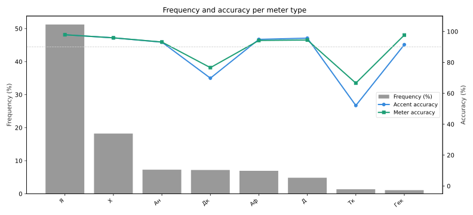

#+PROPERTY: header-args :dir ..
#+PROPERTY: header-args:sqlite :db data/predictions.db :colnames yes

Собираем данные.
#+begin_src sh
  python evaluate_models.py
#+end_src

#+RESULTS:

Лог сборки данных.
#+begin_src sh
  cat main.log
#+end_src

#+RESULTS:
| 2026-05-03 16:09:42 | 971 [INFO] Using device: cpu                                               |
| 2026-05-03 16:09:43 | 003 [INFO] Loading raw samples                                             |
| 2026-05-03 16:10:26 | 062 [INFO] 3010 lines are excluded from dataset as having rare meter types |
| 2026-05-03 16:10:30 | 863 [INFO] Loading poetry dataset                                          |
| 2026-05-03 16:10:32 | 140 [INFO] Dataset loading finished. 57264 samples created                 |
| 2026-05-03 16:11:31 | 481 [INFO] accent_accuracy=0.985296                                        |
| 2026-05-03 16:11:31 | 481 [INFO] meter_accuracy=0.943664                                         |

Процент попаданий для предсказаний метра и ритма

NB: точность для ударений в логе выше, т.к. при логировании
используется расчёт по токенам, а не сравнение формул целиком.
Например, при расчёте по токенам учитывается схожесть между
ритмическими формулами "0101" и "1001". SQL-запрос учитывает только
полные совпадения.
#+begin_src sqlite
  SELECT
    ROUND(AVG(accent_target == accent_pred), 3) as accent_ok,
    ROUND(AVG(meter_target == meter_pred), 3) as meter_ok
  FROM predictions
#+end_src

#+RESULTS:
| accent_ok | meter_ok |
|-----------+----------|
|     0.937 |    0.944 |

Процент попаданий метра и ритма, распределённый по наиболее частым метрам
#+name: accuracy_per_meter
#+begin_src sqlite
  SELECT * FROM (
  SELECT meter_target as meter,
      ROUND(AVG(accent_target == accent_pred), 3) as accent_ok,
      ROUND(AVG(meter_target == meter_pred), 3) as meter_ok,
      ROUND(COUNT(*) * 1.0 / SUM(COUNT(*)) OVER (), 4) AS freq
  FROM predictions
  GROUP BY meter_target
  )
  WHERE freq >= 0.01
  ORDER BY freq DESC
#+end_src

#+RESULTS: accuracy_per_meter
| meter | accent_ok | meter_ok |   freq |
|-------+-----------+----------+--------|
| Я     |     0.979 |    0.979 | 0.5123 |
| Х     |     0.959 |    0.959 | 0.1822 |
| Ан    |     0.931 |    0.932 | 0.0728 |
| Дк    |     0.698 |    0.766 | 0.0719 |
| Аф    |     0.949 |    0.942 | 0.0694 |
| Д     |     0.957 |    0.945 | 0.0484 |
| Тк    |     0.521 |    0.666 | 0.0136 |
| Гек   |     0.915 |    0.977 | 0.0108 |

График, отображающий точность определения метра и ритма по типу метра.
#+begin_src python :var data=accuracy_per_meter :results file link
  import matplotlib.pyplot as plt
  import matplotlib.ticker as mtick
  import numpy as np

  meters, accent, meter_acc, freq = zip(*data)

  BLUE, GREEN, GRAY = "#378ADD", "#1D9E75", "#888780"
  PLOT_PATH = "notebooks/dual_axis.svg"

  fig, ax1 = plt.subplots(figsize=(11, 5))

  x = np.arange(len(meters))
  ax1.bar(x, [f * 100 for f in freq], color="#333", alpha=0.5, label="Frequency (%)")
  ax1.set_ylabel("Frequency (%)", color="#333")
  ax1.tick_params(axis="y", color="#333")
  ax1.set_xticks(x)
  ax1.set_xticklabels(meters, rotation=40, ha="right", fontsize=9)

  ax2 = ax1.twinx()
  ax2.plot(x, [a * 100 for a in accent],   "o-", color=BLUE,  lw=2, ms=5, label="Accent accuracy")
  ax2.plot(x, [m * 100 for m in meter_acc], "s-", color=GREEN, lw=2, ms=5, label="Meter accuracy")
  ax2.set_ylabel("Accuracy (%)", color="#333")
  ax2.set_ylim(-5, 110)
  ax2.axhline(90, color="#ccc", lw=0.8, linestyle="--")

  lines1, labs1 = ax1.get_legend_handles_labels()
  lines2, labs2 = ax2.get_legend_handles_labels()
  ax1.legend(lines1 + lines2, labs1 + labs2, loc="center right", framealpha=0.6, fontsize=9)
  ax1.set_title("Frequency and accuracy per meter type", fontsize=12)
  plt.tight_layout()
  plt.savefig(PLOT_PATH, dpi=150)

  return PLOT_PATH
#+end_src

#+RESULTS:

Для каждого метра собираем соотношение попаданий при правильно
предсказанном ритме, ошибочно предсказанном ритме и общее соотношение
правильных предсказаний.
#+begin_src sqlite
  SELECT
      meter_target as meter,
      ROUND(AVG(accent_pred == accent_target), 3) AS accent_ok_total,
      ROUND(AVG(meter_target == meter_pred), 3) AS meter_ok_total,
      ROUND(AVG(CASE WHEN meter_target == meter_pred THEN accent_target == accent_pred END), 3) AS accent_ok_given_meter_ok,
      ROUND(AVG(CASE WHEN meter_target <> meter_pred THEN accent_target == accent_pred END), 3) AS accent_ok_given_meter_bad,
      COUNT(*) as total
  FROM predictions
  GROUP BY meter_target
  ORDER BY total DESC;
#+end_src

#+RESULTS:
| meter | accent_ok_total | meter_ok_total | accent_ok_given_meter_ok | accent_ok_given_meter_bad | total |
|-------+-----------------+----------------+--------------------------+---------------------------+-------|
| Я     |           0.979 |          0.979 |                    0.996 |                      0.18 | 29339 |
| Х     |           0.959 |          0.959 |                    0.992 |                     0.188 | 10432 |
| Ан    |           0.931 |          0.932 |                    0.999 |                     0.014 |  4171 |
| Дк    |           0.698 |          0.766 |                    0.859 |                     0.175 |  4118 |
| Аф    |           0.949 |          0.942 |                    0.999 |                      0.13 |  3974 |
| Д     |           0.957 |          0.945 |                    0.998 |                     0.243 |  2774 |
| Тк    |           0.521 |          0.666 |                    0.742 |                     0.081 |   779 |
| Гек   |           0.915 |          0.977 |                    0.931 |                     0.214 |   621 |
| Ак    |           0.619 |          0.761 |                    0.736 |                     0.246 |   289 |
| С     |           0.824 |          0.829 |                    0.994 |                       0.0 |   187 |
| Я~Я   |           0.918 |          0.918 |                    0.985 |                     0.167 |   146 |
| Х~Х   |           0.772 |          0.821 |                    0.924 |                     0.077 |   145 |
| Л     |           0.672 |           0.43 |                    0.636 |                     0.699 |   128 |
| Д~Д   |           0.932 |          0.877 |                    0.984 |                     0.556 |    73 |
| Ан~Ан |           0.878 |          0.878 |                      1.0 |                       0.0 |    41 |
| Х*    |           0.647 |          0.647 |                    0.818 |                     0.333 |    17 |
| Я*    |           0.643 |            0.5 |                    0.857 |                     0.429 |    14 |
| Пен   |             0.5 |            0.3 |                      1.0 |                     0.286 |    10 |
| Аф~Аф |             1.0 |          0.833 |                      1.0 |                       1.0 |     6 |

Частота ошибок по парам предсказание/цель
#+begin_src sqlite
  CREATE VIEW error_strata AS
    SELECT
    meter_class_pred AS mc_pred, meter_class_target AS mc_target,
    meter_pred || ' ' || caesura_pred AS pred,
    meter_target || ' ' || caesura_target AS target,
    COUNT(*) cnt,
    ROUND((COUNT(*) * 1.0) / (SUM(COUNT(*)) OVER()), 3) AS freq
    FROM predictions
    WHERE meter_class_target <> meter_class_pred
    GROUP BY meter_class_target, meter_class_pred
    ORDER BY cnt DESC
#+end_src

#+RESULTS:

#+begin_src sqlite
  SELECT * FROM error_strata WHERE freq > 0.01
#+end_src

#+RESULTS:
| mc_pred | mc_target | pred    | target | cnt |  freq |
|---------+-----------+---------+--------+-----+-------|
|       6 |         3 | Тк      | Дк     | 160 |  0.05 |
|       3 |         0 | Дк      | Я      | 137 | 0.042 |
|       8 |         3 | Ак      | Дк     | 136 | 0.042 |
|       2 |         3 | Ан      | Дк     | 114 | 0.035 |
|       1 |         3 | Х       | Дк     | 111 | 0.034 |
|       6 |         0 | Тк      | Я      | 109 | 0.034 |
|       4 |         0 | Аф      | Я      |  94 | 0.029 |
|       6 |         1 | Тк      | Х      |  93 | 0.029 |
|       1 |         2 | Х       | Ан     |  92 | 0.029 |
|       3 |         2 | Дк      | Ан     |  87 | 0.027 |
|       5 |         3 | Д       | Дк     |  85 | 0.026 |
|       3 |         4 | Дк      | Аф     |  82 | 0.025 |
|       3 |         1 | Дк      | Х      |  78 | 0.024 |
|      16 |         1 | Х*      | Х      |  73 | 0.023 |
|      18 |         0 | Я*      | Я      |  66 |  0.02 |
|       0 |         3 | Я       | Дк     |  64 |  0.02 |
|       2 |         1 | Ан      | Х      |  60 | 0.019 |
|       4 |         3 | Аф      | Дк     |  58 | 0.018 |
|       0 |         4 | Я       | Аф     |  58 | 0.018 |
|       1 |         6 | Х       | Тк     |  56 | 0.017 |
|       5 |         0 | Д       | Я      |  55 | 0.017 |
|      10 |         0 | Я~Я 1/2 | Я      |  50 | 0.015 |
|      12 |         3 | Х~Х 1/2 | Дк     |  48 | 0.015 |
|       1 |         5 | Х       | Д      |  47 | 0.015 |
|       3 |         6 | Дк      | Тк     |  46 | 0.014 |
|       3 |        11 | Дк      | Л      |  46 | 0.014 |
|       5 |         1 | Д       | Х      |  43 | 0.013 |
|      13 |         3 | Д~Д 1/2 | Дк     |  40 | 0.012 |
|       3 |         5 | Дк      | Д      |  39 | 0.012 |
|       6 |         2 | Тк      | Ан     |  36 | 0.011 |

Частота присутствия цезуры
#+begin_src sqlite
  SELECT
      ROUND(
          COUNT(*) * 1.0 /
          (SELECT COUNT(*) FROM predictions),
          4
      ) AS caesura_freq
  FROM predictions
  WHERE caesura_target <> ''
#+end_src

#+RESULTS:
| caesura_freq |
|--------------|
|       0.0075 |

Ложнопозитивные определения цезуры
#+begin_src sqlite
  SELECT
      ROUND(
          SUM(caesura_target = '' AND caesura_pred <> '') * 1.0 /
          SUM(caesura_target = ''),
          4
      ) AS false_positive_rate
  FROM predictions
#+end_src

#+RESULTS:
| false_positive_rate |
|---------------------|
|              0.0055 |

Точность в определении цезуры, метра и ударения для тех строк, где присутствует цезура
#+begin_src sqlite
  SELECT ROUND(AVG(caesura_target == caesura_pred), 3) as caesura_ok,
  ROUND(AVG(meter_target == meter_pred), 3) as meter_ok,
  ROUND(AVG(accent_target == accent_pred), 3) as accent_ok
  FROM predictions
  WHERE caesura_target <> ''
#+end_src

#+RESULTS:
| caesura_ok | meter_ok | accent_ok |
|------------+----------+-----------|
|      0.862 |    0.855 |      0.85 |

Точность в определении цезурных форм
#+begin_src sqlite
  SELECT
      caesura_target AS caesura,
      caesura_pred,
      meter_target,
      meter_pred,
      accent_pred == accent_target AS accent_ok,
      COUNT(*) AS cnt
  FROM predictions
  WHERE caesura_target <> ''
  GROUP BY caesura_target, caesura_pred, meter_target, meter_pred
  HAVING cnt > 5
  ORDER BY cnt DESC
#+end_src

#+RESULTS:
| caesura | caesura_pred | meter_target | meter_pred | accent_ok | cnt |
|---------+--------------+--------------+------------+-----------+-----|
| 1/2     | 1/2          | Я~Я          | Я~Я        |         1 | 134 |
| 1/2     | 1/2          | Х~Х          | Х~Х        |         1 |  84 |
| 1/2     | 1/2          | Д~Д          | Д~Д        |         1 |  64 |
| 1/2     | 1/2          | Ан~Ан        | Ан~Ан      |         1 |  35 |
| 4/7     | 4/7          | Х~Х          | Х~Х        |         1 |  33 |
| 1/2     |              | Х~Х          | Дк         |         0 |  11 |

View для сбора ошибок при определении метра
#+begin_src sqlite
  CREATE VIEW meter_errors AS
  SELECT 
      meter_target,
      meter_pred,
      accent_pred == accent_target AS accent_ok,
      COUNT(*) as cnt
  FROM predictions
  WHERE meter_target <> meter_pred
  GROUP BY meter_target, meter_pred, accent_ok;
#+end_src

#+RESULTS:

Ошибки при определении дольника
#+begin_src sqlite
  SELECT *
  FROM meter_errors
  WHERE meter_target = 'Дк' AND cnt > 80
  ORDER BY cnt DESC
#+end_src

#+RESULTS:
| meter_target | meter_pred | accent_ok | cnt |
|--------------+------------+-----------+-----|
| Дк           | Тк         |         0 | 152 |
| Дк           | Ан         |         0 | 112 |
| Дк           | Х          |         0 | 110 |
| Дк           | Д          |         0 |  84 |

Ошибки при определении тактовика:
#+begin_src sqlite
  SELECT *
  FROM meter_errors
  WHERE meter_target = 'Тк' AND cnt > 20
  ORDER BY cnt DESC
#+end_src

#+RESULTS:
| meter_target | meter_pred | accent_ok | cnt |
|--------------+------------+-----------+-----|
| Тк           | Х          |         0 |  56 |
| Тк           | Дк         |         0 |  49 |
| Тк           | Я          |         0 |  31 |
| Тк           | Ак         |         0 |  26 |

Распределение праильных предсказаний метра по количеству стоп в строке
#+begin_src sqlite
  SELECT
      feet,
      ROUND(AVG(meter_pred = meter_target), 3) AS correct_ratio,
      COUNT(*) as cnt
  FROM (
      SELECT
          meter_pred,
          meter_target,
          LENGTH(REPLACE(accent_target, '0', '')) AS feet
      FROM predictions
      WHERE meter_target <> 'С' -- Исключаем силлабику
  )
  GROUP BY feet
  ORDER BY feet;
#+end_src

#+RESULTS:
| feet | correct_ratio |   cnt |
|------+---------------+-------|
|    0 |         0.333 |     3 |
|    1 |         0.565 |   526 |
|    2 |         0.852 |  3287 |
|    3 |         0.913 | 11473 |
|    4 |         0.965 | 24467 |
|    5 |         0.968 | 10518 |
|    6 |         0.969 |  6382 |
|    7 |         0.713 |   230 |
|    8 |         0.885 |   174 |
|    9 |         0.667 |     6 |
|   10 |           0.8 |     5 |
|   11 |           0.5 |     2 |
|   12 |           1.0 |     2 |
|   13 |           0.0 |     1 |
|   24 |           1.0 |     1 |

Ошибки в определении ударений для гекзаметра
#+begin_src sqlite
  SELECT
  accent_target,
  ROUND(AVG(accent_target == accent_pred), 3) AS accent_ok_ratio,
  COUNT(*) as cnt
  FROM predictions
  WHERE meter_target == 'Гек'
  GROUP BY accent_target
  HAVING cnt > 10
  ORDER BY cnt DESC
#+end_src

#+RESULTS:
|     accent_target | accent_ok_ratio | cnt |
|-------------------+-----------------+-----|
| 10010010010010010 |           0.992 | 243 |
|  1001001010010010 |           0.933 |  90 |
|  1001001001010010 |           0.899 |  69 |
|  1010010010010010 |            0.86 |  50 |
|  1001010010010010 |           0.814 |  43 |
|   100100101010010 |           0.935 |  31 |
|   101001010010010 |            0.87 |  23 |
|   101001001010010 |             1.0 |  15 |
|   100101001010010 |           0.846 |  13 |

